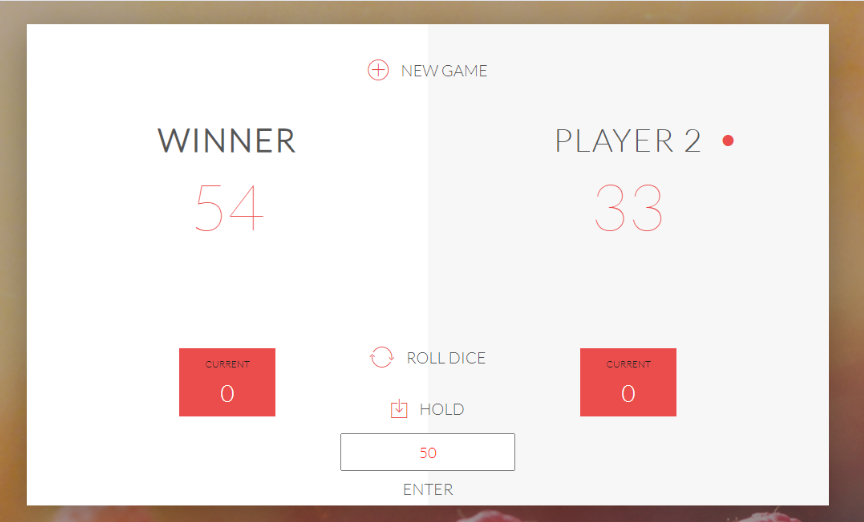

# PIG-GAME
Javascript based 2 player game. Players take turns to roll a single die as many times as they wish, adding all roll results to a running total, but losing their gained score for the turn if they roll a 0.

# Images
# Roll dice
 

# Winner (player with score greater than total score here 50)

